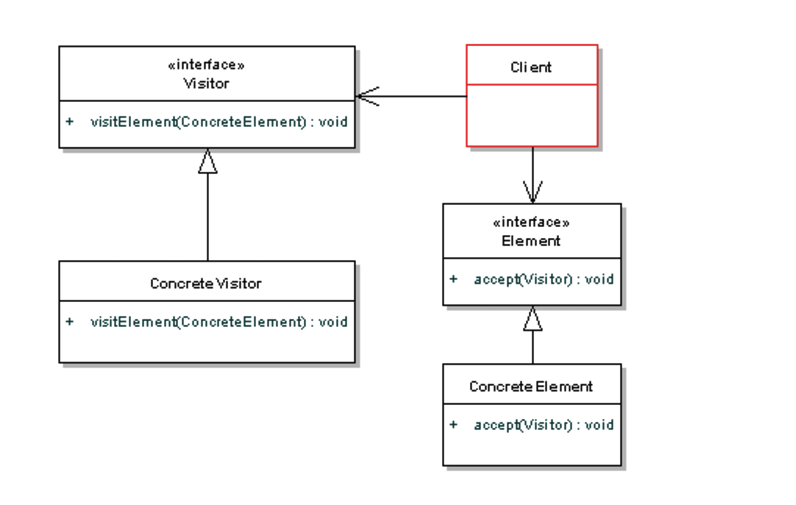

### 定义
>Allows for one or more operation to be applied to a set of objects at runtime, decoupling the operations from the object structure. 

 while the Visitor may seem a bit strange at first, 
 you can see how much it helps to clean up your code. 
 That's the whole point of this pattern - to allow you seperate out certain logic from the elements themselves, keeping your data classes simple.(SRP)
 
### UML

 